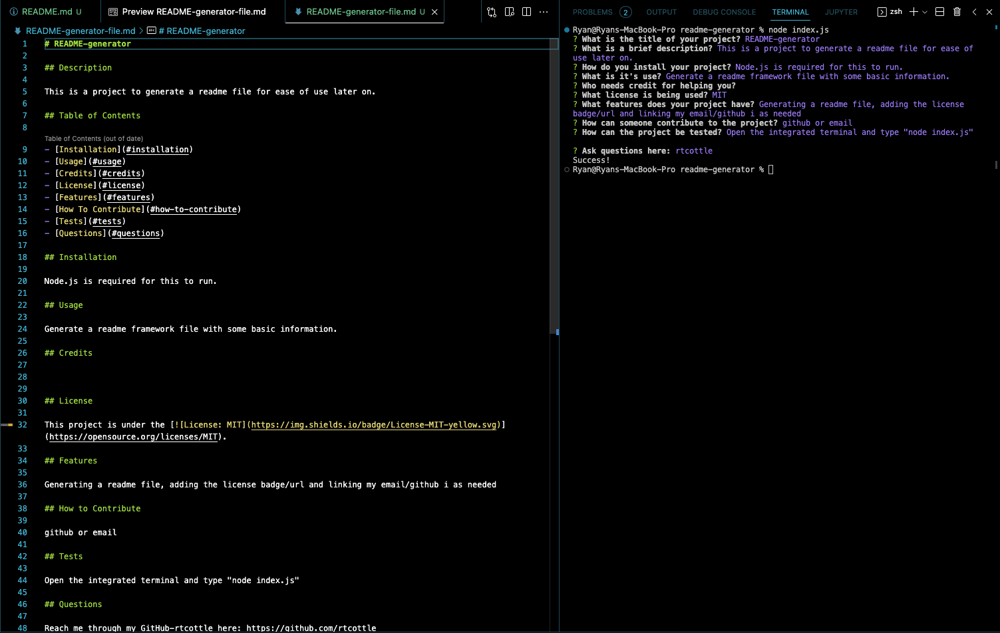

# README-generator

## Description

This is a project to generate a readme file for ease of use later on.

## Table of Contents

- [README-generator](#readme-generator)
  - [Description](#description)
  - [Table of Contents](#table-of-contents)
  - [Installation](#installation)
  - [Usage](#usage)
  - [Credits](#credits)
  - [License](#license)
  - [Features](#features)
  - [How to Contribute](#how-to-contribute)
  - [Tests](#tests)
  - [Questions](#questions)

## Installation

Node.js is required for this to run. Find the link here: https://nodejs.org/en/download/

## Usage

Generate a readme framework file with some basic information.

Link to video of this program working: https://drive.google.com/file/d/1CFXFXSCEnvwX0oDdUZck_2fa6rP3CxBW/view

## Credits

README formatting: https://coding-boot-camp.github.io/full-stack/github/professional-readme-guide/
Inquirer: https://www.npmjs.com/package/inquirer

## License

This project is under the .

## Features

Generating a readme file, adding the license badge/url and linking my email/github as needed.

## How to Contribute

github or email

## Tests

Open the integrated terminal from the index.js and type "node index.js"

## Questions

Reach me through my GitHub-rtcottle here: https://github.com/rtcottle
